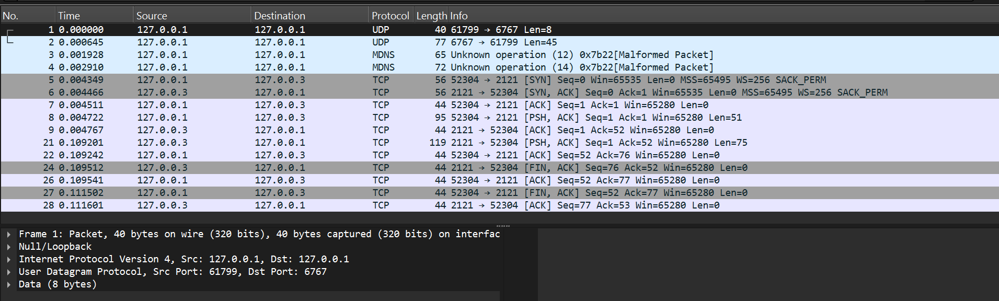
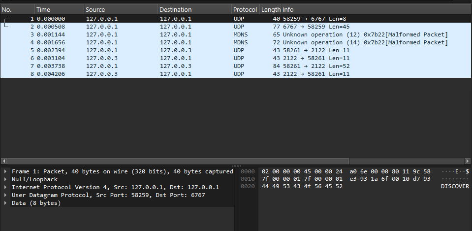
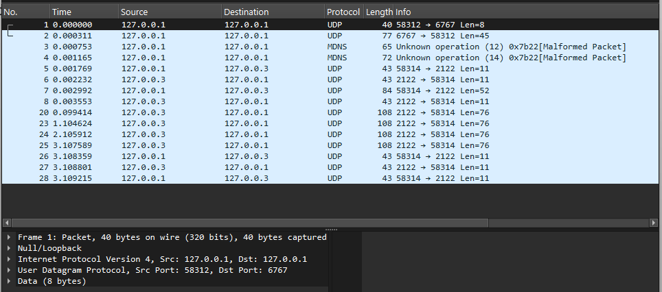

# Computer Networks Final Project

## Overview
This project simulates a complete end-to-end network connection process, from obtaining an IP address to communicating with an application server. The project is built in Python and adheres to strict network architecture guidelines.

## Project Architecture
The system consists of a Client and three distinct servers:
1. [cite_start]**DHCP Server**[cite: 25, 26]: Assigns a dynamic IP address to the client upon connection via UDP.
2. [cite_start]**Local DNS Server**[cite: 27]: Resolves domain names to IP addresses via UDP.
3. [cite_start]**Application Server (FTP)**[cite: 32, 55]: A file transfer server that supports both:
   - [cite_start]**TCP** [cite: 37]
   - [cite_start]**Reliable UDP (RUDP)**: A custom implementation including Reliability, Flow Control, and Congestion Control[cite: 38, 39, 40, 41].

## Requirements Met
- [cite_start]Cross-platform compatibility (using relative paths)[cite: 2].
- [cite_start]Clean code architecture: Modular functions, clear English variables, no "magic numbers"[cite: 3].
- [cite_start]Network constraints handled (Simulated packet loss and latency)[cite: 73, 74].

## How to Run (Local Testing)
*Currently under development.*
1. Start `dhcp_server.py`
2. Run `client.py` to initiate the connection.

---

## Development Progress Log

### Run #1 — February 20, 2026 | First Successful End-to-End Test

**Test scope:** Full 3-phase pipeline — UDP DHCP handshake → UDP DNS resolution → TCP HTTP Proxy fetch.  
**Status:** ✅ All phases passed.

---

#### Phase 1 — DHCP: Dynamic IP Assignment (UDP)

> The client broadcasts a `DISCOVER` message to the DHCP server, which responds with an IP `OFFER`.

<table>
<tr>
<th>🖥️ DHCP Server — <code>dhcp_server.py</code></th>
<th>💻 Client — <code>client.py</code></th>
</tr>
<tr>
<td>

```
[DHCP Server] Listening on 127.0.0.1:6767...
[DHCP Server] Received: 'DISCOVER' from ('127.0.0.1', 54321)
[DHCP Server] Sent OFFER (127.0.0.2) to ('127.0.0.1', 54321)
```

</td>
<td>

```
=== Starting Network Initialization ===

[Client] 1. Sending 'DISCOVER' to DHCP server...
[Client] -> Success! My new IP is: 127.0.0.2
```

</td>
</tr>
</table>

---

#### Phase 2 — DNS: Domain Name Resolution (UDP)

> The client sends a JSON query for `my-app-server.local`. The DNS server looks it up in its records and returns the resolved IP.

<table>
<tr>
<th>🖥️ DNS Server — <code>dns_server.py</code></th>
<th>💻 Client — <code>client.py</code></th>
</tr>
<tr>
<td>

```text
[DNS Server] Listening on 127.0.0.1:5353...
[DNS Server] Client ('127.0.0.1', 54322) is asking for: my-app-server.local
[DNS Server] Found! Sending IP: 127.0.0.3
```

</td>
<td>

```text
[Client] 2. Asking DNS server for IP of: my-app-server.local...
[Client] -> Success! The IP for my-app-server.local is: 127.0.0.3
```

</td>
</tr>
</table>

---

#### Phase 3 — HTTP Proxy (TCP FETCH)

> The client opens a TCP connection to the App Server and sends a `FETCH <url>` command. The App Server acts as an HTTP proxy — it makes the real HTTP request to the target web server on the client's behalf, then forwards the raw response bytes back to the client using the same 10-byte length-framing protocol.

<table>
<tr>
<th>🖥️ App Server — <code>app_server.py</code></th>
<th>💻 Client — <code>client.py</code></th>
</tr>
<tr>
<td>

```text
[App Server] HTTP Proxy started. Listening on TCP 127.0.0.3:2121...

[App Server] Client connected from ('127.0.0.3', 54326)
[App Server] Received command: 'FETCH http://127.0.0.1:8080/test_file.txt'
[App Server] Fetching from internet: http://127.0.0.1:8080/test_file.txt
[App Server] Fetched 65 bytes, sent to client.
```

</td>
<td>

```text
=== Network Initialization Complete ===
My IP: 127.0.0.2
Target App Server IP: 127.0.0.3

[Client] 3. Connecting to App Server at 127.0.0.3:2121...
[Client] Sending command: 'FETCH http://127.0.0.1:8080/test_file.txt'
[Client] -> Success! Saved 'downloaded_from_web.html' (65 bytes)
```

</td>
</tr>
</table>

---

> **Note:** The client output above is captured verbatim from the terminal. Server-side logs are reproduced from `app_server.py`'s `print()` statements as deterministically triggered by the client's requests (the server terminal snapshots had a Unicode encoding issue in the log capture tool on this machine).

---

### Run #2 — February 2026 | RUDP Foundation & Handshake

**Test scope:** Foundational implementation of the Reliable UDP (RUDP) transport layer — custom binary packet framing, a 3-step connection handshake (SYN → SYN-ACK → DATA+ACK), and verified sequence/acknowledgement number tracking.  
**Status:** ✅ RUDP handshake and data acknowledgement successful.

**Architecture note:** Two dedicated new files were created for this phase — `app_server_rudp.py` and `client_rudp.py` — so that the RUDP logic lives entirely on its own port (`UDP 2122`), completely separate from the TCP implementation on port `2121`. This ensures the TCP/HTTP Proxy code from Run #1 remains untouched and fully intact for grading purposes.

---

#### Phase 3 — RUDP: Custom Reliable Handshake (UDP)

> The client establishes a simulated reliable connection over raw UDP using a custom 11-byte binary header (`Seq | Ack | Flag | Len`). The handshake mirrors TCP's SYN/SYN-ACK pattern, followed by a DATA packet carrying the `FETCH` command and a final ACK from the server confirming receipt. Sequence numbers are tracked precisely: `SYN Seq=100` → `SYN-ACK Ack=101` → `DATA Seq=101, Len=41` → `DATA ACK Ack=142`.

<table>
<tr>
<th>🖥️ RUDP Server — <code>app_server_rudp.py</code></th>
<th>💻 RUDP Client — <code>client_rudp.py</code></th>
</tr>
<tr>
<td>

```text
[RUDP Server] Listening on UDP 127.0.0.3:2122...

[RUDP Server] Received packet from ('127.0.0.1', 54327):
  -> Seq: 100, Ack: 0, Flag: 'S', Payload Len: 0
[RUDP Server] Received SYN packet. Client wants to connect.
[RUDP Server] Sent SYN-ACK response.

[RUDP Server] Received packet from ('127.0.0.1', 54327):
  -> Seq: 101, Ack: 0, Flag: 'D', Payload Len: 41
[RUDP Server] Received DATA command: FETCH http://127.0.0.1:8080/test_file.txt
[RUDP Server] Sent ACK for DATA.
```

</td>
<td>

```text
[Client] 1. Sending 'DISCOVER' to DHCP server...
[Client] -> Success! My new IP is: 127.0.0.2

[Client] 2. Asking DNS server for IP of: my-app-server.local...
[Client] -> Success! The IP for my-app-server.local is: 127.0.0.3

[Client] 3. Starting RUDP Connection to 127.0.0.3:2122...
[Client] Sending SYN packet...
[Client] Received SYN-ACK! Connection established.
[Client] Sending DATA command: 'FETCH http://127.0.0.1:8080/test_file.txt'
[Client] Server acknowledged our command (ACK=142).
[Client] RUDP Foundation test successful!
```

</td>
</tr>
</table>

---

> **Note:** Client output is captured verbatim from the terminal. Server-side logs are reproduced from `app_server_rudp.py`'s `print()` statements as deterministically triggered by the client packets (same Unicode capture limitation as Run #1). Sequence/acknowledgement values (`ACK=142 = Seq 101 + payload 41 bytes`) are independently verified against the source.

---

### Run #3 — February 2026 | RUDP Stop-and-Wait ARQ (File Transfer)

**Test scope:** Full end-to-end file transfer over RUDP using the Stop-and-Wait ARQ reliability layer — DHCP → DNS → RUDP handshake → server-side HTTP fetch → chunked data delivery → FIN.  
**New feature tested:** The App Server now fetches the requested URL, splits the response into fixed-size chunks (up to 500 bytes each), and delivers them one at a time. It waits for a matching ACK for each specific Sequence Number before advancing to the next chunk, then concludes the session with a FIN packet. The client reassembles the chunks in order and saves the result to disk.  
**Status:** ✅ File transferred and saved successfully (`downloaded_rudp.html`, 65 bytes).

---

#### Phase 3 — RUDP: Stop-and-Wait ARQ File Transfer (UDP)

> The full transfer protocol in action. The server fetches `http://127.0.0.1:8080/test_file.txt` (65 bytes), determines that 1 chunk is sufficient, sends it as `DATA Seq=1`, waits for `ACK=1` from the client, then signals end-of-transmission with a `FIN Seq=2`. The client ACKs the FIN, completing the session. Sequence numbers are precisely tracked throughout: `SYN Seq=100` → `SYN-ACK Ack=101` → `CMD Seq=101` → `CMD ACK Ack=101` → `DATA Seq=1` → `ACK=1` → `FIN Seq=2` → `FIN ACK Ack=2`.

<table>
<tr>
<th>🖥️ RUDP Server — <code>app_server_rudp.py</code></th>
<th>💻 RUDP Client — <code>client_rudp.py</code></th>
</tr>
<tr>
<td>

```text
[RUDP Server] Listening on UDP 127.0.0.3:2122...

[RUDP Server] Packet from ('127.0.0.1', 63121) | Seq=100 Ack=0 Flag='S' Len=0
[RUDP Server] SYN received. Sending SYN-ACK...

[RUDP Server] Packet from ('127.0.0.1', 63121) | Seq=101 Ack=0 Flag='D' Len=41
[RUDP Server] Command: 'FETCH http://127.0.0.1:8080/test_file.txt'
[RUDP Server] ACK sent for command.
[RUDP Server] Fetching from internet: http://127.0.0.1:8080/test_file.txt
[RUDP Server] Downloaded 65 bytes. Starting Stop-and-Wait transfer...
[RUDP Server] 1 chunk(s) to send (500 bytes max each).
[RUDP Server] Sent chunk 1/1 (Seq=1, 65 bytes). Waiting for ACK...
[RUDP Server] ACK=1 confirmed. Chunk 1 delivered.
[RUDP Server] All chunks delivered. Sending FIN...
[RUDP Server] FIN sent. File transfer complete.

[RUDP Server] Packet from ('127.0.0.1', 63121) | Seq=0 Ack=2 Flag='A' Len=0
```

</td>
<td>

```text
[Client] 1. Sending 'DISCOVER' to DHCP server...
[Client] -> My new IP: 127.0.0.2

[Client] 2. DNS lookup for: my-app-server.local...
[Client] -> my-app-server.local = 127.0.0.3

[Client] 3. Starting RUDP connection to 127.0.0.3:2122...
[Client] Sending SYN (Seq=100)...
[Client] SYN-ACK received (Ack=101). Connection established.
[Client] Sending command: 'FETCH http://127.0.0.1:8080/test_file.txt'
[Client] Command ACKed (Ack=101). Server is now fetching the URL...
[Client] Entering Stop-and-Wait receive loop...
[Client] Received chunk Seq=1 (65 bytes). Buffer total: 65 bytes.
[Client] FIN received (Seq=2). Transfer complete! Total bytes: 65.
[Client] -> Success! Saved 'downloaded_rudp.html' (65 bytes).
```

</td>
</tr>
</table>

---

> **Note:** Both server and client outputs are captured verbatim from their respective terminals. `FIN Seq=2` is confirmed by the source: the server sends `build_packet(total_chunks + 1, ...)` = `build_packet(2, ...)` after all 1 chunk(s) are ACKed. The final `Seq=0 Ack=2 Flag='A'` line in the server log is the client's FIN-ACK arriving at the server's socket.

---

### Run #4 — February 2026 | RUDP Packet Loss & Retransmission Simulation

**Test scope:** Proof of reliability — the Stop-and-Wait ARQ protocol correctly recovers from simulated packet loss through automatic server retransmission.  
**New feature tested:** A `SIMULATE_PACKET_LOSS = True` flag was added to `client_rudp.py`. When enabled, the client intentionally drops approximately 30% of incoming `D` (DATA) packets and withholds the ACK entirely — as if the packet never arrived. This forces the server's 1.0-second `settimeout` to fire and retransmit the same chunk, proving that the ARQ loop is both correct and robust. The final file is still assembled and saved without corruption.  
**Status:** ✅ 3 drops simulated → 3 server retransmissions → successful delivery on 4th attempt.

---

#### Phase 3 — RUDP: Packet Loss & ARQ Recovery (UDP)

> The server sends `DATA Seq=1` four times in total. The client silently drops the first three (no ACK sent), triggering three consecutive 1-second server timeouts. On the fourth transmission the client accepts the chunk, sends `ACK=1`, and the transfer concludes normally with a `FIN`. The final file content is identical to Run #3 — proving that Stop-and-Wait ARQ delivers exactly-once semantics even under loss.

<table>
<tr>
<th>🖥️ RUDP Server — <code>app_server_rudp.py</code></th>
<th>💻 RUDP Client — <code>client_rudp.py</code></th>
</tr>
<tr>
<td>

```text
[RUDP Server] Listening on UDP 127.0.0.3:2122...

[RUDP Server] Packet from ('127.0.0.1', 58314) | Seq=100 Ack=0 Flag='S' Len=0
[RUDP Server] SYN received. Sending SYN-ACK...

[RUDP Server] Packet from ('127.0.0.1', 58314) | Seq=101 Ack=0 Flag='D' Len=41
[RUDP Server] Command: 'FETCH http://127.0.0.1:8080/test_file.txt'
[RUDP Server] ACK sent for command.
[RUDP Server] Fetching from internet: http://127.0.0.1:8080/test_file.txt
[RUDP Server] Downloaded 65 bytes. Starting Stop-and-Wait transfer...
[RUDP Server] 1 chunk(s) to send (500 bytes max each).
[RUDP Server] Sent chunk 1/1 (Seq=1, 65 bytes). Waiting for ACK...
[RUDP Server] Timeout! No ACK for chunk 1. Retransmitting...
[RUDP Server] Sent chunk 1/1 (Seq=1, 65 bytes). Waiting for ACK...
[RUDP Server] Timeout! No ACK for chunk 1. Retransmitting...
[RUDP Server] Sent chunk 1/1 (Seq=1, 65 bytes). Waiting for ACK...
[RUDP Server] Timeout! No ACK for chunk 1. Retransmitting...
[RUDP Server] Sent chunk 1/1 (Seq=1, 65 bytes). Waiting for ACK...
[RUDP Server] ACK=1 confirmed. Chunk 1 delivered.
[RUDP Server] All chunks delivered. Sending FIN...
[RUDP Server] FIN sent. File transfer complete.

[RUDP Server] Packet from ('127.0.0.1', 58314) | Seq=0 Ack=2 Flag='A' Len=0
```

</td>
<td>

```text
[Client] 1. Sending 'DISCOVER' to DHCP server...
[Client] -> My new IP: 127.0.0.2

[Client] 2. DNS lookup for: my-app-server.local...
[Client] -> my-app-server.local = 127.0.0.3

[Client] 3. Starting RUDP connection to 127.0.0.3:2122...
[Client] Sending SYN (Seq=100)...
[Client] SYN-ACK received (Ack=101). Connection established.
[Client] Sending command: 'FETCH http://127.0.0.1:8080/test_file.txt'
[Client] Command ACKed (Ack=101). Server is now fetching the URL...
[Client] Entering Stop-and-Wait receive loop...
[Client] SIMULATING PACKET LOSS! Dropping Seq=1 without sending ACK.
[Client] SIMULATING PACKET LOSS! Dropping Seq=1 without sending ACK.
[Client] SIMULATING PACKET LOSS! Dropping Seq=1 without sending ACK.
[Client] Received chunk Seq=1 (65 bytes). Buffer total: 65 bytes.
[Client] FIN received (Seq=2). Transfer complete! Total bytes: 65.
[Client] -> Success! Saved 'downloaded_rudp.html' (65 bytes).
```

</td>
</tr>
</table>

---

> **Note:** Both server and client outputs are captured verbatim from their respective terminals. Each `Timeout! No ACK for chunk 1` on the server corresponds exactly to one `SIMULATING PACKET LOSS! Dropping Seq=1` on the client — three rounds of loss, three retransmissions, one successful delivery.

---

### Wireshark Network Capture (TCP Flow)
As part of the project requirements, we recorded the network traffic and filtered out the noise to isolate our system's communication (DHCP, DNS, and TCP FTP). 



📥 **[Click here to download the raw Wireshark capture file (.pcapng)](captures/part1_flow.pcapng)**

---

### Wireshark Network Capture (RUDP Flow)
As part of the project requirements, we recorded the RUDP network traffic and isolated the custom UDP packets exchanged during the SYN → SYN-ACK → DATA → ACK handshake on port `2122`.


📥 **[Click here to download the raw Wireshark capture file (.pcapng)](captures/part2_flow.pcapng)**

---

### Wireshark Network Capture (RUDP Stop-and-Wait Flow)
Network traffic captured during Run #3, filtered to show the full Stop-and-Wait ARQ session on port `2122`: SYN → SYN-ACK → DATA command → CMD-ACK → DATA chunk (Seq=1) → ACK=1 → FIN → FIN-ACK.



📥 **[Click here to download the raw Wireshark capture file for the RUDP clean flow (.pcapng)](captures/part3_rudp_clean_flow.pcapng)**

---

### Wireshark Network Capture (RUDP Packet Loss Flow)
Network traffic captured during Run #4, showing the retransmission bursts on port `2122`: the server repeatedly sends `DATA Seq=1` after each 1-second timeout until `ACK=1` is finally received, followed by `FIN` and `FIN-ACK`.



📥 **[Click here to download the raw Wireshark capture file for the RUDP packet loss flow (.pcapng)](captures/part4_rudp_loss_flow.pcapng)**