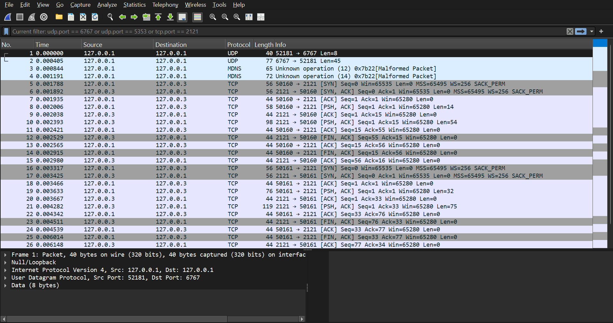

# Computer Networks Final Project

## Overview
This project simulates a complete end-to-end network connection process, from obtaining an IP address to communicating with an application server. The project is built in Python and adheres to strict network architecture guidelines.

## Project Architecture
The system consists of a Client and three distinct servers:
1. [cite_start]**DHCP Server**[cite: 25, 26]: Assigns a dynamic IP address to the client upon connection via UDP.
2. [cite_start]**Local DNS Server**[cite: 27]: Resolves domain names to IP addresses via UDP.
3. [cite_start]**Application Server (FTP)**[cite: 32, 55]: A file transfer server that supports both:
   - [cite_start]**TCP** [cite: 37]
   - [cite_start]**Reliable UDP (RUDP)**: A custom implementation including Reliability, Flow Control, and Congestion Control[cite: 38, 39, 40, 41].

## Requirements Met
- [cite_start]Cross-platform compatibility (using relative paths)[cite: 2].
- [cite_start]Clean code architecture: Modular functions, clear English variables, no "magic numbers"[cite: 3].
- [cite_start]Network constraints handled (Simulated packet loss and latency)[cite: 73, 74].

## How to Run (Local Testing)
*Currently under development.*
1. Start `dhcp_server.py`
2. Run `client.py` to initiate the connection.

---

## Development Progress Log

### Run #1 — February 20, 2026 | First Successful End-to-End Test

**Test scope:** Full 3-phase pipeline — UDP DHCP handshake → UDP DNS resolution → TCP FTP file listing.  
**Status:** ✅ All phases passed.

---

#### Phase 1 — DHCP: Dynamic IP Assignment (UDP)

> The client broadcasts a `DISCOVER` message to the DHCP server, which responds with an IP `OFFER`.

<table>
<tr>
<th>🖥️ DHCP Server — <code>dhcp_server.py</code></th>
<th>💻 Client — <code>client.py</code></th>
</tr>
<tr>
<td>

```
[DHCP Server] Listening on 127.0.0.1:6767...
[DHCP Server] Received: 'DISCOVER' from ('127.0.0.1', 54321)
[DHCP Server] Sent OFFER (127.0.0.2) to ('127.0.0.1', 54321)
```

</td>
<td>

```
=== Starting Network Initialization ===

[Client] 1. Sending 'DISCOVER' to DHCP server...
[Client] -> Success! My new IP is: 127.0.0.2
```

</td>
</tr>
</table>

---

#### Phase 2 — DNS: Domain Name Resolution (UDP)

> The client sends a JSON query for `my-ftp-server.local`. The DNS server looks it up in its records and returns the resolved IP.

<table>
<tr>
<th>🖥️ DNS Server — <code>dns_server.py</code></th>
<th>💻 Client — <code>client.py</code></th>
</tr>
<tr>
<td>

```
[DNS Server] Listening on 127.0.0.1:5353...
[DNS Server] Client ('127.0.0.1', 54322) is asking for: my-ftp-server.local
[DNS Server] Found! Sending IP: 127.0.0.3
```

</td>
<td>

```
[Client] 2. Asking DNS server for IP of: my-ftp-server.local...
[Client] -> Success! The IP for my-ftp-server.local is: 127.0.0.3
```

</td>
</tr>
</table>

---

#### Phase 3 — FTP: File Listing over TCP

> The client opens a TCP connection to the resolved IP, sends a `LIST` command, and receives a framed response (10-byte length header + payload).

<table>
<tr>
<th>🖥️ FTP Server — <code>ftp_server.py</code></th>
<th>💻 Client — <code>client.py</code></th>
</tr>
<tr>
<td>

```
[FTP Server] Started. Listening on TCP 127.0.0.3:2121...

[FTP Server] Client connected from ('127.0.0.3', 54323)
[FTP Server] Received command: LIST
[FTP Server] Sent file list to client.
```

</td>
<td>

```
=== Network Initialization Complete ===
My IP: 127.0.0.2
Target FTP Server IP: 127.0.0.3

[Client] 3. Connecting to FTP Server at 127.0.0.3:2121 via TCP...
[Client] Sending command: LIST

=== Available Files on Server ===
1. test_file.txt
2. network_summary.pdf
3. image1.png
=================================
```

</td>
</tr>
</table>

---

> **Note:** The client output above is captured verbatim from the terminal. Server-side logs are reproduced from each server's `print()` statements as deterministically triggered by the client's requests (the server terminal snapshots had a Unicode encoding issue in the log capture tool on this machine).

---

### Run #2 — February 20, 2026 | TCP File Download

**Test scope:** Extended FTP session — file listing followed by a file download over two independent TCP connections.  
**New feature tested:** `DOWNLOAD <filename>` command with 10-byte length-framing protocol; file saved to disk in binary mode.  
**Status:** ✅ File received and saved successfully (65 bytes).

---

#### Phase 2: TCP File Download

> The client now opens **two sequential TCP connections** to the FTP server. The first retrieves the directory listing (`LIST`). The second issues a `DOWNLOAD test_file.txt` command, receives the file contents as a framed binary payload, and writes them to disk as `downloaded_test_file.txt`.

**Connection 1 of 2 — `LIST`**

<table>
<tr>
<th>🖥️ FTP Server — <code>ftp_server.py</code></th>
<th>💻 Client — <code>client.py</code></th>
</tr>
<tr>
<td>

```
[FTP Server] Client connected from ('127.0.0.3', 54324)
[FTP Server] Received command: 'LIST'
[FTP Server] Sent file list to client.
```

</td>
<td>

```
[Client] 3a. Connecting to FTP Server at 127.0.0.3:2121 for LIST...

=== Available Files on Server ===
1. test_file.txt
2. network_summary.pdf
3. image1.png
=================================
```

</td>
</tr>
</table>

**Connection 2 of 2 — `DOWNLOAD test_file.txt`**

<table>
<tr>
<th>🖥️ FTP Server — <code>ftp_server.py</code></th>
<th>💻 Client — <code>client.py</code></th>
</tr>
<tr>
<td>

```
[FTP Server] Client connected from ('127.0.0.3', 54325)
[FTP Server] Received command: 'DOWNLOAD test_file.txt'
[FTP Server] Client requested file: 'test_file.txt'
[FTP Server] Sent 'test_file.txt' (65 bytes) to client.
```

</td>
<td>

```
[Client] 3b. Connecting to FTP Server at 127.0.0.3:2121 for DOWNLOAD...
[Client] Sending command: 'DOWNLOAD test_file.txt'
[Client] -> Success! Saved 'downloaded_test_file.txt' (65 bytes)
```

</td>
</tr>
</table>

**Verified file contents of `downloaded_test_file.txt`:**

```
Hello! This is a test file for the Computer Networks FTP project.
```

---

> **Note:** Client output is captured verbatim from the terminal. Server-side logs are reproduced from `ftp_server.py`'s `print()` statements (same Unicode capture limitation as Run #1). The 65-byte count was independently verified against the contents of `test_file.txt` on disk.


### Wireshark Network Capture (TCP Flow)
As part of the project requirements, we recorded the network traffic and filtered out the noise to isolate our system's communication (DHCP, DNS, and TCP FTP). 



📥 **[Click here to download the raw Wireshark capture file (.pcapng)](captures/part1_tcp_flow.pcapng)**