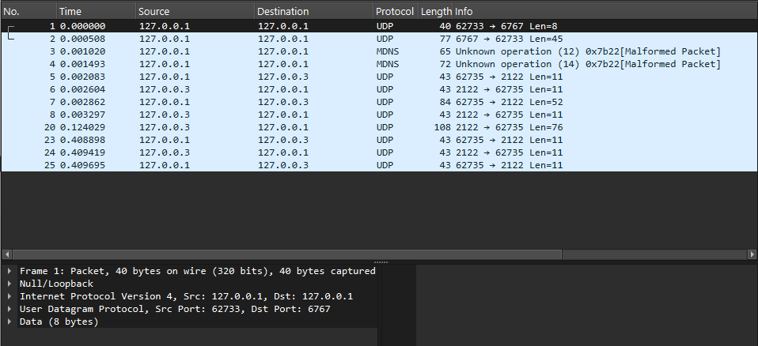

# Computer Networks Final Project

Hello! This is my final project for the **Computer Networks** course.

In this project, I built a complete network simulation from scratch using only Python's standard `socket` library. The goal was to simulate the full process of a computer joining a network and downloading a file — from receiving a dynamic IP address, to resolving a domain name, all the way to a reliable file transfer.

I implemented the project in two main phases as required:

- **Phase 1 & 2 — TCP:** Standard TCP file transfer using a custom application-level framing header to handle message boundaries correctly.
- **Phase 3 — RUDP:** A fully custom *Reliable UDP* protocol built from scratch, with a binary header, Go-Back-N sliding window, and AIMD Congestion Control.

---

## My Network Architecture

I separated the logic into small, independent files to simulate real, distinct network components:

| File | Role |
|---|---|
| `dhcp_server.py` | DHCP Server — assigns an IP address to the client via UDP. |
| `dns_server.py` | DNS Server — resolves `my-app-server.local` to an IP via UDP. |
| `app_server.py` | TCP App Server (HTTP Proxy) — receives a `FETCH` command and downloads the file over TCP. |
| `client.py` | TCP Client — runs the full sequence: DHCP → DNS → TCP fetch → save file. |
| `app_server_rudp.py` | RUDP App Server — same job as the TCP server but uses my custom reliable UDP protocol. |
| `client_rudp.py` | RUDP Client — same flow but uses my RUDP protocol for the transfer. |

### The Full Network Flow (Step by Step)

1. The client starts with no IP address. It sends a `DISCOVER` UDP message to the **DHCP Server** at `127.0.0.1:6767`. The server replies with `{"type": "OFFER", "assigned_ip": "127.0.0.2"}`.
2. Now that it has an IP, the client sends a JSON query `{"domain": "my-app-server.local"}` to the **DNS Server** at `127.0.0.1:5353`. The server replies with `{"status": "SUCCESS", "ip": "127.0.0.3"}`.
3. The client connects to the **App Server** at `127.0.0.3` and sends a `FETCH http://127.0.0.1:8080/test_file.txt` command.
4. The App Server downloads the file from the local HTTP server (`python -m http.server 8080`) and sends all the bytes back to the client.
5. The client saves the received file to disk — `downloaded_from_web.html` (TCP) or `downloaded_rudp.html` (RUDP).

---

## Important Design Decisions

### TCP Framing — The 10-Byte Length Header

TCP is a *stream* protocol. It has no built-in concept of individual messages — the OS can split one `send()` call into multiple fragments, or merge several `send()` calls into one delivery. If I just call `recv()`, I have no idea whether I got a complete message or only part of one.

To solve this, I use a technique called **length-prefix framing**. Before sending any payload, I prepend a **10-byte, zero-padded ASCII length field**:

```
[0000000065][Hello! This is a test file for the Computer Networks FTP project.]
 ^-- 10-byte header --^  ^-- 65 bytes of actual data (the real content) --^
```

The receiver always reads **exactly 10 bytes** first, converts them to an integer (e.g. `65`), and then loops calling `recv()` until it has accumulated exactly that many bytes. This guarantees a clean, complete message every time, no matter how TCP splits the stream. This logic is in `send_framed()` and `receive_framed()` in both `client.py` and `app_server.py`.

### The Local HTTP Server — Bypassing Firewall Issues

The App Servers need to actually download a real file from a URL. To make sure this works reliably during grading without any firewall configuration, I host `test_file.txt` locally using Python's built-in HTTP server:

```bash
python -m http.server 8080
```

This makes `http://127.0.0.1:8080/test_file.txt` available on the loopback interface, which is never blocked by a firewall. **This command must be running in the background before starting any test.**

### The RUDP Protocol — Building Reliability on Top of UDP

UDP is unreliable. Packets can be lost, delayed, or arrive out of order. To make file transfer reliable, I built my own protocol on top of UDP using:

**1. A Custom 11-Byte Binary Header**

Every RUDP packet starts with an 11-byte header packed using `struct.pack('!IIcH', seq, ack, flag, data_len)`:

| Field | Size | Description |
|---|---|---|
| `seq` | 4 bytes | Sequence number of this packet |
| `ack` | 4 bytes | Acknowledgement number |
| `flag` | 1 byte | Packet type: `S` = SYN, `A` = ACK, `D` = DATA, `F` = FIN |
| `data_len` | 2 bytes | Length of the payload that follows the header |

The format string `'!IIcH'` is defined identically in both `app_server_rudp.py` and `client_rudp.py` and must never be changed.

**2. Connection Handshake (SYN → SYN-ACK)**

Before any data is sent, the client and server do a small handshake to confirm the channel is working. The client sends a SYN packet with `seq=100`. The server responds with `ack=101` (seq+1). This mirrors the concept of a TCP 3-way handshake.

**3. Go-Back-N Sliding Window**

The server maintains three variables:
- `window_size`: how many unACKed packets can be in-flight at once
- `base_seq`: the sequence number of the oldest unACKed packet (left edge of the window)
- `next_seq`: the sequence number of the next packet to transmit

It sends all packets from `next_seq` up to `base_seq + window_size - 1`, then waits for an ACK. If an ACK arrives and is valid (ack >= base_seq), the window slides forward. If a **timeout** fires (1 second), the server rewinds `next_seq = base_seq` and retransmits the entire unACKed window from the beginning — this is the "Go-Back-N" part.

**4. AIMD Congestion Control**

The `window_size` grows and shrinks automatically based on network conditions:
- **Additive Increase:** `window_size += 1` on every valid ACK (capped at `MAX_WINDOW = 5`).
- **Multiplicative Decrease:** `window_size //= 2` on every timeout (floored at `1`).

**5. Simulation Flags in `client_rudp.py`**

To prove that the protocol actually handles network problems, I added two flags at the top of `client_rudp.py`:

```python
SIMULATE_PACKET_LOSS = True  # Randomly drops ~30% of incoming DATA packets without ACKing them.
SIMULATE_LATENCY     = True  # Calls time.sleep(0.1–0.4s) before processing each packet.
```

`SIMULATE_PACKET_LOSS` forces the server's 1-second timeout to fire and triggers retransmission, proving the Go-Back-N loop works. `SIMULATE_LATENCY` simulates a slow network link, making the delayed ACKs and window fluctuation visible in Wireshark — exactly as required by the assignment.

---

## Pre-requisite Setup

**Before running any test**, open a terminal in this project folder and run:

```bash
python -m http.server 8080
```

Leave it running. This hosts `test_file.txt` at `http://127.0.0.1:8080/test_file.txt`, which all App Servers fetch from.

---

## Test #1 — The TCP Flow (Phase 1 & 2)

This test proves that the DHCP server, DNS server, and TCP proxy all work together correctly end-to-end.

### How to Run

> Make sure `python -m http.server 8080` is already running.

1. Open **Terminal 1** → `python dhcp_server.py`
2. Open **Terminal 2** → `python dns_server.py`
3. Open **Terminal 3** → `python app_server.py`
4. Open **Terminal 4** → `python client.py`

### Expected Terminal Output

**DHCP Server — `dhcp_server.py`**

```text
starting DHCP server...
DHCP server listening on 127.0.0.1:6767
waiting for DHCP request...
received 'DISCOVER' from ('127.0.0.1', 54321)
DISCOVER received. sending OFFER (ip=127.0.0.2)
OFFER sent to ('127.0.0.1', 54321)
waiting for DHCP request...
```

**DNS Server — `dns_server.py`**

```text
starting DNS server...
DNS server listening on 127.0.0.1:5353
waiting for DNS query...
received query from ('127.0.0.1', 54322): {"domain": "my-app-server.local"}
looking up: 'my-app-server.local'
found: my-app-server.local -> 127.0.0.3
response sent to ('127.0.0.1', 54322)
waiting for DNS query...
```

**App Server — `app_server.py`**

```text
starting app server (HTTP proxy)...
listening on TCP 127.0.0.3:2121
waiting for client connection...
client connected from ('127.0.0.1', 54323)
reading length header...
command length: 41 bytes
reading command...
received command: 'FETCH http://127.0.0.1:8080/test_file.txt'
fetching: http://127.0.0.1:8080/test_file.txt
download complete: 65 bytes
sending 65 bytes (header='0000000065')
closing connection with ('127.0.0.1', 54323)
ready for next client.
waiting for client connection...
```

**Client — `client.py`**

```text
=== starting network initialization ===

--- step 1: DHCP ---
sending DISCOVER to 127.0.0.1:6767...
DHCP reply: {'type': 'OFFER', 'assigned_ip': '127.0.0.2'}
assigned IP: 127.0.0.2

--- step 2: DNS ---
querying DNS for 'my-app-server.local'...
DNS reply: {'status': 'SUCCESS', 'ip': '127.0.0.3'}
resolved: my-app-server.local -> 127.0.0.3

initialization complete. my IP: 127.0.0.2, server: 127.0.0.3

--- step 3: app server ---
connecting to 127.0.0.3:2121...
connected.
sending: 'FETCH http://127.0.0.1:8080/test_file.txt' (41 bytes)
waiting for response...
reading length header...
expecting 65 bytes...
  received 0/65. requesting 65 more...
receive complete: 65 bytes total.
response received: 65 bytes
file saved: 'downloaded_from_web.html' (65 bytes)
socket closed.
```

---

## Test #2 — The Advanced RUDP Flow (Phase 3)

This test proves my custom Reliable UDP protocol works. It uses a Go-Back-N sliding window with AIMD Congestion Control, plus simulated packet loss and latency to demonstrate the protocol handles real-world conditions.

The example output below shows one packet drop followed by a successful retransmission.

### How to Run

> Make sure `python -m http.server 8080`, `python dhcp_server.py`, and `python dns_server.py` are all still running.

1. Stop `app_server.py` if it is still running.
2. Open **Terminal 3** → `python app_server_rudp.py`
3. Open **Terminal 4** → `python client_rudp.py`

To run a clean transfer without simulations, set both flags to `False` at the top of `client_rudp.py`:
```python
SIMULATE_PACKET_LOSS = False
SIMULATE_LATENCY     = False
```

### Expected Terminal Output

**RUDP Server — `app_server_rudp.py`**

```text
starting RUDP server...
RUDP server listening on UDP 127.0.0.3:2122

waiting for packet (blocking)...
received 11 bytes from ('127.0.0.1', 60123)
header: seq=100, ack=0, flag='S', data_len=0
SYN received. sending SYN-ACK...
SYN-ACK sent (ack=101)

waiting for packet (blocking)...
received 52 bytes from ('127.0.0.1', 60123)
header: seq=101, ack=0, flag='D', data_len=41
DATA received. command: 'FETCH http://127.0.0.1:8080/test_file.txt'
command ACKed (ack=101)
fetching: http://127.0.0.1:8080/test_file.txt
download complete: 65 bytes
split into 1 chunk(s). starting Go-Back-N transfer.
window: [1..1], size=1, next_seq=1
  sent seq=1 (65 bytes)
waiting for ACK (1s timeout)...
timeout: timed out
timeout. window_size=1.
going back to seq=1.
window: [1..1], size=1, next_seq=1
  sent seq=1 (65 bytes)
waiting for ACK (1s timeout)...
received: flag='A', ack=1
got ACK for chunk 1. sliding window.
window_size now 2.
all chunks delivered. sending FIN.
FIN sent. transfer complete.
```

**RUDP Client — `client_rudp.py`**

```text
=== RUDP client starting ===

--- step 1: DHCP ---
sending DISCOVER to 127.0.0.1:6767...
DHCP OFFER received. assigned IP: 127.0.0.2

--- step 2: DNS ---
querying DNS for 'my-app-server.local'...
DNS reply: {'status': 'SUCCESS', 'ip': '127.0.0.3'}
resolved: my-app-server.local -> 127.0.0.3

initialization complete. my IP: 127.0.0.2, server: 127.0.0.3

--- step 3: RUDP ---
sending SYN (seq=100)...
SYN-ACK received: flag='A', ack=101
handshake complete.
sending command: 'FETCH http://127.0.0.1:8080/test_file.txt'
command ACK: flag='A', ack=101
command acknowledged. server is fetching the URL.
starting receive loop...
waiting for next packet...
received 76 bytes.
  seq=1, flag='D', data_len=65
  latency sim: sleeping 0.35s (seq=1)
  loss sim: dropping seq=1. no ACK sent.
waiting for next packet...
received 76 bytes.
  seq=1, flag='D', data_len=65
  latency sim: sleeping 0.12s (seq=1)
  in-order seq=1. buffering and sending ACK. buffer=65 bytes.
waiting for next packet...
received 11 bytes.
  seq=2, flag='F', data_len=0
FIN received (seq=2). transfer complete. buffer=65 bytes.
ACK sent for FIN.
file saved: 'downloaded_rudp.html' (65 bytes)
socket closed.
```

---

## Wireshark Network Captures

As part of the assignment, I recorded the network traffic on my local Loopback adapter. Below are the screenshots and raw capture files proving all phases of the project work correctly.

Wireshark filter used:
```
udp.port == 6767 or udp.port == 5353 or tcp.port == 2121 or udp.port == 2122
```

---

### 1. TCP Complete Flow

Shows the DHCP assignment, DNS resolution, and the full TCP proxy fetch with the framed response.


📥 **[Click here to download the raw Wireshark capture file (.pcapng)](captures/part1_flow.pcapng)**

---

### 2. RUDP Foundation & Handshake

Shows the custom SYN, SYN-ACK, and first DATA command exchange over raw UDP using the 11-byte binary header.


📥 **[Click here to download the raw Wireshark capture file (.pcapng)](captures/part2_flow.pcapng)**

---

### 3. RUDP Stop-and-Wait Clean Flow

Shows the full transfer with the custom 11-byte headers, a single data chunk, and the FIN packet, without any simulated packet loss.


📥 **[Click here to download the raw Wireshark capture file for the RUDP clean flow (.pcapng)](captures/part3_rudp_clean_flow.pcapng)**

---

### 4. RUDP Packet Loss & Recovery

Shows the server timing out and retransmitting the same chunk multiple times because the client's `SIMULATE_PACKET_LOSS` flag dropped the incoming DATA packets. Proves the Go-Back-N retransmission loop works correctly.


📥 **[Click here to download the raw Wireshark capture file for the RUDP packet loss flow (.pcapng)](captures/part4_rudp_loss_flow.pcapng)**

---

### 5. RUDP Advanced Flow (Sliding Window & Latency)

Shows the Go-Back-N sliding window session with delayed ACKs caused by the `SIMULATE_LATENCY` flag. The delay between each DATA chunk and its ACK is clearly visible in the packet timestamps.



📥 **[Click here to download the raw Wireshark capture file for the RUDP advanced flow (.pcapng)](captures/part5_rudp_advanced_flow.pcapng)**
